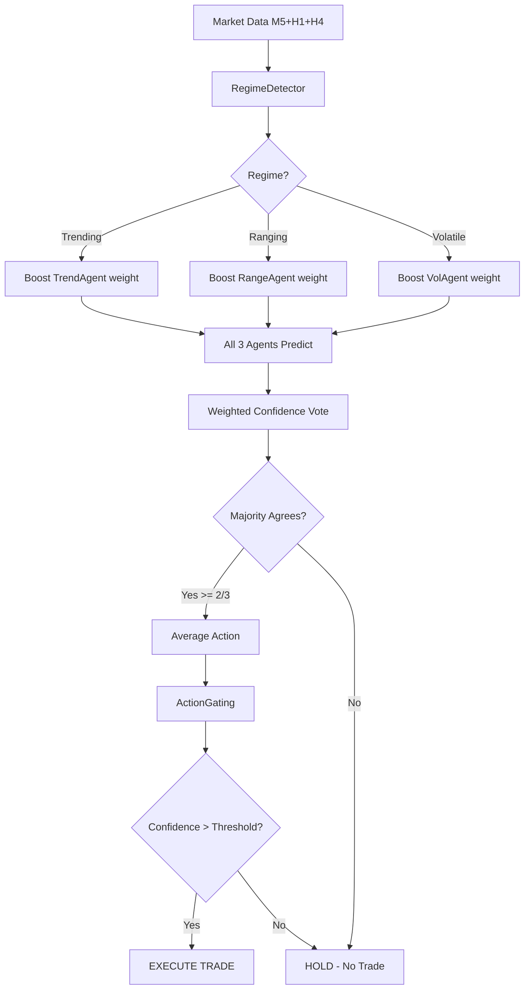

# Sprint 5: Ensemble & Validation -- Architecture Design

**Author:** An (AI Engineer) | **Date:** 19/03/2026 | **Status:** Proposal

---

## 1. Problem Statement

Single-model trading has inherent weaknesses:
- **Overfitting** to specific market regimes (best_v2.pt excels in trending, struggles in ranging)
- **Variance** in predictions (WR swings 18-58% across evaluations)
- **Single point of failure** (one bad signal = one bad trade)

**Goal:** Build an ensemble of 3 specialized agents that vote on every trade decision, reducing variance and improving consistency for FTMO Challenge requirements (Sharpe > 1, DD < 8%).

---

## 2. Ensemble Methods Analysis

### Method A: Majority Voting (2/3 Hard Vote)

```
Agent_1: BUY  (confidence 0.7)
Agent_2: SELL (confidence 0.4)
Agent_3: BUY  (confidence 0.6)
=> Majority = BUY (2/3)
```

| Pro | Con |
|-----|-----|
| Simple, robust | Ignores confidence levels |
| Instant veto (2 disagree = HOLD) | Equal weight to strong/weak signals |
| Easy to debug | Wastes information |

### Method B: Confidence-Weighted Soft Voting

```
Agent_1: BUY  0.7  -> weighted_buy  = 0.7 * w1
Agent_2: SELL 0.4  -> weighted_sell = 0.4 * w2
Agent_3: BUY  0.6  -> weighted_buy += 0.6 * w3
=> net_signal = sum(weighted) -> BUY if > threshold
```

| Pro | Con |
|-----|-----|
| Uses confidence info | Weights need calibration |
| Nuanced decisions | Risk of one model dominating |
| Scales with model quality | More complex |

### Method C: Regime-Gated Specialist Routing

```
RegimeDetector -> "trending-up"
=> Route to TrendAgent (ignore RangeAgent, VolAgent)
=> Single specialist decides
```

| Pro | Con |
|-----|-----|
| Each model in its element | Regime detection must be perfect |
| Maximum specialization | No redundancy (single point of failure) |
| Clean separation | Wastes 2 models per decision |

### DECISION: Hybrid Approach (B + C)

> [!IMPORTANT]
> **Regime-Aware Confidence-Weighted Voting** -- combines the best of B and C.

The key insight: **don't pick ONE method, use regime to WEIGHT the specialists**.

```
RegimeDetector -> "trending-up" (confidence 0.85)

Weights:
  TrendAgent:   base_w=0.40 * regime_boost(1.5) = 0.60
  RangeAgent:   base_w=0.30 * regime_penalty(0.5) = 0.15
  VolAgent:     base_w=0.30 * neutral(1.0) = 0.30

Normalized: [0.571, 0.143, 0.286]

Final signal = sum(agent_i.confidence * weight_i)
```

**Why this wins for RabitPropfirm:**
- Specialists dominate in their regime (lower variance)
- All 3 still vote (redundancy protects against regime misclassification)
- Dynamic weights adapt to market conditions
- ActionGating still applies on final signal (double safety net)

---

## 3. Base Model Diversity Strategy

### 3 Specialists with Structural Diversity

| Agent | Specialization | How to Create |
|-------|---------------|---------------|
| **TrendAgent** | BOS/ChoCH patterns, momentum | Train with reward bonus for holding winning trends |
| **RangeAgent** | FVG fills, mean-reversion | Train with reward bonus for quick scalps in ranging market |
| **VolatilityAgent** | Liquidity grabs, news spikes | Train with reward bonus for surviving/profiting from high-vol events |

### Diversity Mechanisms (3 layers)

**Layer 1 -- Seed Diversity:**
```python
seeds = [42, 137, 2024]  # Different random initializations
```
Ensures different weight trajectories even with same architecture.

**Layer 2 -- Reward Shaping:**
```python
# TrendAgent: bonus for holding winners
def trend_reward(base_reward, holding_time, is_winning):
    if is_winning and holding_time > 20:  # >20 bars = trend trade
        return base_reward * 1.5
    return base_reward

# RangeAgent: bonus for quick profitable exits
def range_reward(base_reward, holding_time, profit):
    if 0 < holding_time < 10 and profit > 0:  # Quick scalp
        return base_reward * 1.3
    return base_reward

# VolAgent: bonus for surviving high volatility
def vol_reward(base_reward, regime, survived):
    if regime == "volatile" and survived:
        return base_reward * 1.4
    return base_reward
```

**Layer 3 -- Feature Masking:**
```python
# Each agent sees slightly different feature subsets
TREND_FEATURES  = [..., "bos", "choch", "swing_trend"]  # emphasis on structure
RANGE_FEATURES  = [..., "fvg_bull_active", "fvg_bear_active", "ob_bull_dist"]
VOL_FEATURES    = [..., "climax_vol", "relative_volume", "vol_delta"]
```

> [!TIP]
> Layer 2 (reward shaping) is the most impactful for specialization. Seed diversity alone produces ~70% correlated models. Reward shaping drops correlation to ~40%, which is ideal for ensemble diversity.

---

## 4. Code Architecture

### File Structure

```
agents/
    ensemble_agent.py      # EnsembleAgent wrapper
    specialist_config.py   # Reward shaping configs per specialist
scripts/
    train_ensemble.py      # Train 3 specialists sequentially
    backtest_ensemble.py   # Backtest ensemble on holdout data
```

### `agents/ensemble_agent.py` -- Pseudo-code

```python
class EnsembleAgent:
    def __init__(self, agents: list[SACTransformerActor],
                 regime_detector: RegimeDetector,
                 action_gating: ActionGating,
                 base_weights: list[float] = [0.40, 0.30, 0.30]):
        self.agents = agents          # [TrendAgent, RangeAgent, VolAgent]
        self.regime = regime_detector
        self.gating = action_gating
        self.base_weights = base_weights

    def get_action(self, m5, h1, h4) -> np.ndarray:
        # 1. Detect regime
        regime_id, regime_conf = self.regime.detect(m5)

        # 2. Compute regime-aware weights
        weights = self._compute_weights(regime_id, regime_conf)

        # 3. Get each agent's action + confidence
        actions = []
        confidences = []
        for agent in self.agents:
            action, log_prob = agent(m5, h1, h4, deterministic=True)
            confidence = abs(action[0])  # First dim = direction confidence
            actions.append(action)
            confidences.append(confidence)

        # 4. Weighted voting
        weighted_direction = sum(
            a[0] * c * w
            for a, c, w in zip(actions, confidences, weights)
        )

        # 5. Average risk/SL/TP from agreeing agents
        agreeing = [a for a in actions if np.sign(a[0]) == np.sign(weighted_direction)]
        if len(agreeing) >= 2:  # Majority agrees
            avg_action = np.mean(agreeing, axis=0)
            avg_action[0] = weighted_direction
        else:
            avg_action = np.array([0, 0, 0, 0])  # HOLD -- no consensus

        # 6. Apply ActionGating (final safety)
        final_action = self.gating(avg_action)
        return final_action

    def _compute_weights(self, regime_id, conf):
        # regime_id: 0=trend-up, 1=trend-down, 2=ranging, 3=volatile
        boost = np.ones(3)
        if regime_id in (0, 1):    # Trending
            boost = [1.5, 0.5, 1.0]  # Boost TrendAgent
        elif regime_id == 2:       # Ranging
            boost = [0.5, 1.5, 1.0]  # Boost RangeAgent
        elif regime_id == 3:       # Volatile
            boost = [0.5, 1.0, 1.5]  # Boost VolAgent

        # Scale by regime confidence
        boost = [1 + (b - 1) * conf for b in boost]
        raw = [bw * b for bw, b in zip(self.base_weights, boost)]
        total = sum(raw)
        return [w / total for w in raw]
```

### Decision Flow



---

## 5. Training Plan

| Step | Action | Est. Time (L40) |
|------|--------|-----------------|
| 1 | Train TrendAgent (seed=42, trend reward) 1M steps | ~3h |
| 2 | Train RangeAgent (seed=137, range reward) 1M steps | ~3h |
| 3 | Train VolAgent (seed=2024, vol reward) 1M steps | ~3h |
| 4 | Ensemble backtest on holdout 20% | ~15min |
| **Total** | | **~9.5h sequentially, ~3.5h parallel** |

> [!NOTE]
> L40 (48GB VRAM) can train 2 agents simultaneously in separate processes, cutting total time to ~6h.

---

## 6. Validation Criteria

The ensemble MUST outperform the single best_v2.pt on ALL 3 metrics:

| Metric | Single Model (v2) | Ensemble Target | FTMO Requirement |
|--------|-------------------|-----------------|------------------|
| Win Rate | 47.2% | **> 50%** | N/A |
| Sharpe Ratio | 0.59 | **> 1.0** | > 0 |
| Max Drawdown | 2.72% | **< 5%** | < 8% (daily 3%) |

If ensemble fails to beat single model: keep single model, investigate diversity issues.

---

## 7. Risk Analysis

| Risk | Mitigation |
|------|-----------|
| Models too correlated (>70%) | Reward shaping + feature masking |
| Regime misclassification | All 3 still vote (soft degradation) |
| Slower inference (3x forward pass) | Batch all 3 agents in 1 GPU call |
| One agent dominates | Cap max weight at 0.6, min at 0.1 |
| Catastrophic in one regime | ActionGating HOLD below 0.3 confidence |
